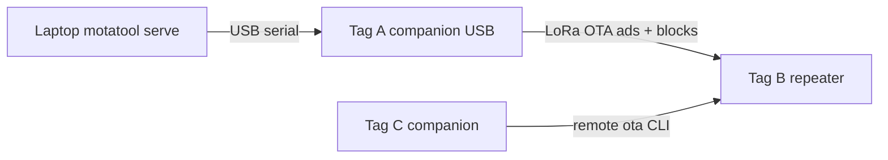

# WisMesh Tag 3-node OTA test bench

On nRF52, `motatool serve` talks USB serial to a companion (`OTA_FOLDER_SERIAL`); the companion advertises `.mota` files over LoRa; the repeater fetches/installs; a second companion is for remote admin once the RF path works.



## Hardware roles

| Tag | Firmware env | Bootloader | Job |
|---|---|---|---|
| A (seeder) | OTA-branch MeshCore with `ENABLE_OTA` + `OTA_FOLDER_SERIAL` (repeater **or** companion USB) | stock BL OK | USB to laptop; `motatool serve` |
| B (router) | `RAK_WisMesh_Tag_repeater` (OTA branch) | **vk-otafix (RTAG) required** | Device under test — fetch + install |
| C (client) | companion (OTA branch nice-to-have) | stock BL OK | MeshCore app / remote admin to B |

**Only Tag B needs OTAFIX** (to *apply* in-place deltas).  
**Tag A must still be an OTA-capable build** from `feature/ota-lora` so `ota folder on` exists — a normal/stock non-OTA repeater cannot seed. Role can be repeater or companion; bootloader on A can stay stock.

## First test: version-bump delta

Helper at repo root: [`build-mota.sh`](build-mota.sh) — builds `RAK_WisMesh_Tag_repeater` as `v1.17.n` into `motas/An/` (hex, uf2, full `.mota`; for n≥1 also in-place delta from the previous slot).

Pass criterion: after install, B reports **v1.17.1**.

```bash
./build-mota.sh 0          # motas/A0/  (v1.17.0) — flash Tag B from A0 uf2/zip
./build-mota.sh 1          # motas/A1/  (v1.17.1) + delta from A0
motatool serve --dir ./motas/A1 --serial … -v   # or serve ./motas if you flatten/copy deltas
```

4. Tag A: serve the folder that contains the A1 delta `.mota`
5. Tag B over **USB serial console** (see below):
   ```text
   ota status          # v1.17.0 + bootloader: apply OK
   ota ls              # expect delta [yours] v1.17.1
   ota get 1 flash
   ota status          # wait COMPLETE
   ota install
   ota status          # expect v1.17.1
   ```

Do **not** start from stock MeshCore tags (no EndF). Both A0 and A1 must be OTA-branch builds. Keep A0’s exact `.hex` as `--base` (rebuilds of “the same” source can still mismatch).

### USB serial console on Tag B

The repeater exposes a text CLI over USB at **115200 8N1** (`Serial.begin(115200)`). You type `ota …` there — not a separate tool.

1. Plug Tag B into the Mac.
2. Find the port: `ls /dev/tty.usbmodem*` (sometimes `tty.usbserial*`).
3. Open a terminal session, e.g.:
   ```bash
   screen /dev/tty.usbmodemXXXX 115200
   # or
   pio device monitor -b 115200
   ```
4. Press Enter, then run the `ota` commands above.
5. Leave `screen`: `Ctrl-A` then `K` (confirm), or `Ctrl-A` `\`.

Notes:
- Only one process can hold the port. Tag A is for `motatool serve`; keep Tag B’s port free for your monitor.
- After `ota install`, B reboots — reconnect serial if the session drops.
- Same console described in [ota_user_guide.md](vk496-ota/docs/ota_user_guide.md) (“USB serial terminal”).

## Flash Tag B with vk-otafix

```bash
./build-bl.sh                 # Docker build; UF2 → motas/bootloader/
# or: ./build-bl.sh wismesh_tag
```

Double-press reset → copy the UF2 from `motas/bootloader/`. Erase ExtraFS if coming from companion/Ripple, then flash A0 repeater app (`./build-mota.sh 0`). Confirm `bootloader: apply OK`.

## Later (optional)

- Full `.mota` path if delta path is flaky
- Tag C remote `ota status`
- Signed + `autoinstall trusted`
- Another bump (v1.17.1 → v1.17.2) as a second delta lap

## What must match

- Delta: `base_hash` == B’s EndF `body_hash`
- `[yours]`: `target_id` for `RAK_WisMesh_Tag_repeater`
- Codec in-place; B’s BL has `MOTABLDR` + codec bit 2
